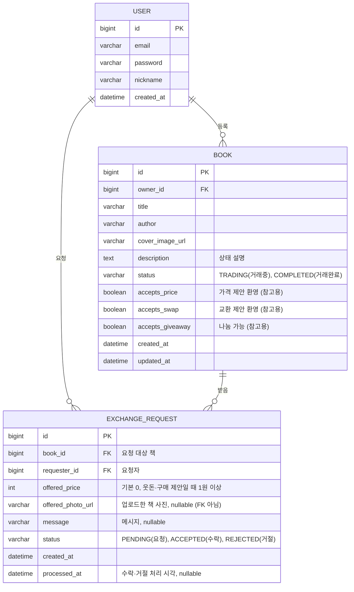

# ERD (펩시미만잡)

> `Book`·`ExchangeRequest` 엔티티로 구현 완료(2026-09-29). 컬럼 추가되면 이 문서도 같이 수정 — mermaid 코드 바로 고치면 됨(https://mermaid.live 에서 미리보기 가능, GitHub에서도 자동 렌더링).

## 참고

- `book.status`(책 자체 거래 상태)와 `exchange_request.status`(개별 요청 상태)는 서로 다른 축 — 헷갈리지 않도록 분리.
- `exchange_request`에 `type` 컬럼을 따로 두지 않음. `offered_price`(기본 0)와 `offered_photo_url`(nullable)의 조합으로 요청 종류가 **계산**됨. `offered_photo_url`은 기존 등록된 책을 참조(FK)하는 게 아니라 요청 시 그냥 이미지를 업로드하는 것 — 내가 등록한 책이 아니어도 제시 가능.

  | 가격 | 책 사진 | 의미 |
  |---|---|---|
  | 0원 | 있음 | 교환 요청 |
  | 1원 이상 | 있음 | 웃돈 주고 교환 제안 |
  | 0원 | 없음 | 나눔 요청 |
  | 1원 이상 | 없음 | 구매 제안(순수 가격 제시) |

- `book.accepts_price`/`accepts_swap`/`accepts_giveaway`는 등록자가 "받고 싶은 조건"을 참고용으로 표시하는 값 — 강제 제한이 아니라서 요청자는 이 값과 무관하게 아무 조합이나 제안할 수 있음.
- 인기 도서 랭킹·동시 수락 방지 락은 DB 테이블이 아니라 Redis에만 존재([04_Redis키설계.md](04_Redis키설계.md) 참고).

