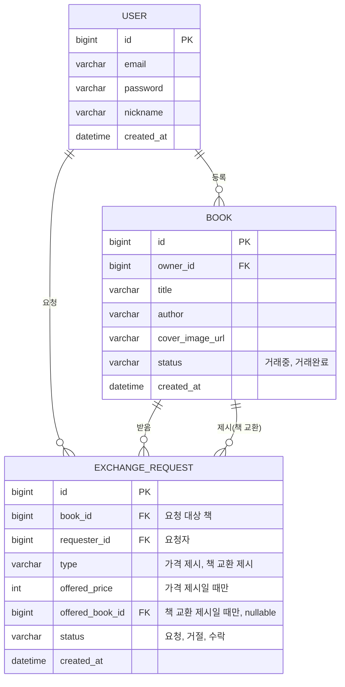

# ERD (펩시미만잡)

> 초안. 스켈레톤 병합하면서 실제 컬럼명·타입은 조정될 수 있음. 수정은 아래 mermaid 코드를 바로 고치면 됨(https://mermaid.live 에서 미리보기 가능, GitHub에서도 자동 렌더링).

## 참고

- `book.status`(책 자체 거래 상태)와 `exchange_request.status`(개별 요청 상태)는 서로 다른 축 — 헷갈리지 않도록 분리.
- `exchange_request.type`에 따라 `offered_price` 또는 `offered_book_id` 중 하나만 채워짐(상호 배타적).
- 인기 도서 랭킹·동시 수락 방지 락은 DB 테이블이 아니라 Redis에만 존재([04_Redis키설계.md](04_Redis키설계.md) 참고).
